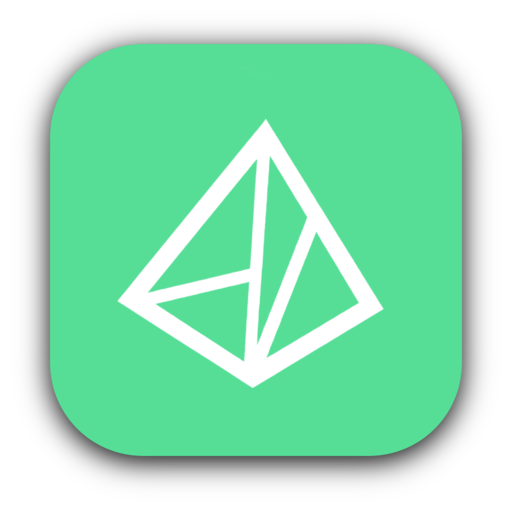

  

<h1 align="center">Latex4All</h1>

  A desktop LaTeX editor with Claude in it. 
  Your documents stay on your disk and compile locally.

> ### A fork of [Claude Prism](https://github.com/delibae/claude-prism)
>
> Latex4All is a personal fork of [delibae/claude-prism](https://github.com/delibae/claude-prism).
> Everything added on top of it, such as Zotero
> integration and one-click BibTeX capture, dictionary/thesaurus (WordNet) and
> grammar checking, LaTeX autocompletion, the Windows port, and the self-updating
> release/test channels was implemented by me through vibe-coding. As a disclaimer, i am not a programmer nor do i intend to pass as one, i just wanted to add features that i deeemed useful.
>
> **My involvement is direction, not authorship.** I decided what to build, made
> the design and architecture calls, tested it on real documents and hardware, and
> reviewed what came back — but I did not hand-write the implementation. Please
> judge the code on that basis, and prefer upstream if you want a project with
> conventional human authorship.

  

  &nbsp;
  

  &nbsp;
  

  Test builds carry every change as it lands, and are rougher than a release. 
  Linux and Intel macOS are no longer published — build from source if you need either.

---

## What it is

A native application for writing LaTeX, with Claude available in the editor and
a PDF preview beside the source. LaTeX compiles inside the app, so there is no
TeX installation to maintain, and every save is kept in a local history you can
browse and roll back.

It also carries a Python environment and a large library of scientific skills
for Claude, both from upstream. [Claude Prism](https://github.com/delibae/claude-prism)
documents that side of it in full.

## What this fork adds

**Zotero.** Browse your library without leaving the editor, search it by title
or author, insert citations, and add a single reference to a `.bib` file from
its context menu.

**Dictionary, thesaurus and spell checking.** Right-click a word for its
definition, synonyms and antonyms. Grammar checking runs locally rather than
through a service. English and Spanish.

**LaTeX autocompletion,** and a reference panel for the commands nobody
remembers.

**Windows.** The spelling, thesaurus and grammar services were ported, and CI
builds Windows installers alongside macOS.

**Updates in the app.** Two channels — releases, and a test channel that
publishes every change as it lands. You can move between them in either
direction, including back down from a test build to the current release, and
each update shows what changed.

## Data and privacy

Your documents are stored and compiled on your own machine. Nothing is uploaded
for storage.

The AI features are not local. When Claude reads or edits a file, that content
is sent to Anthropic's API, as with any hosted model. See
[Claude Code data usage](https://code.claude.com/docs/en/data-usage) for
retention and opt-out.

## Installing

Download a build from [Releases](https://github.com/Alejandro-Raga/Latex4all/releases),
or build from source — see [CONTRIBUTING.md](./CONTRIBUTING.md).

macOS builds are ad-hoc signed rather than notarised, because the project has no
Apple Developer account.

## Contributing

[CONTRIBUTING.md](./CONTRIBUTING.md) covers development setup and testing.

## Acknowledgments

Built on [Claude Prism](https://github.com/delibae/claude-prism), which in turn
started from [Open Prism](https://github.com/assistant-ui/open-prism) by
[assistant-ui](https://github.com/assistant-ui).

## License

[MIT](./LICENSE)
